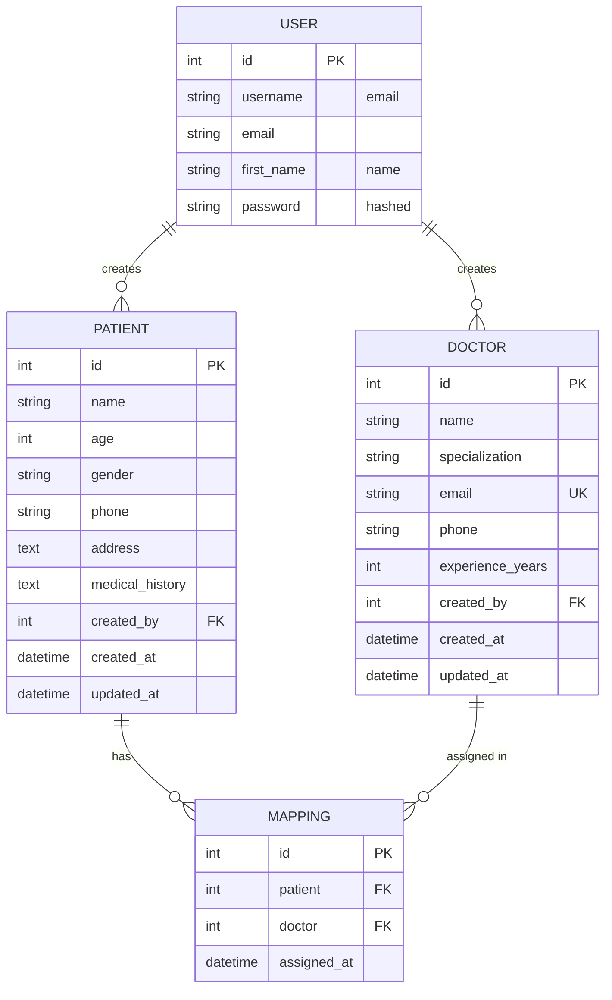
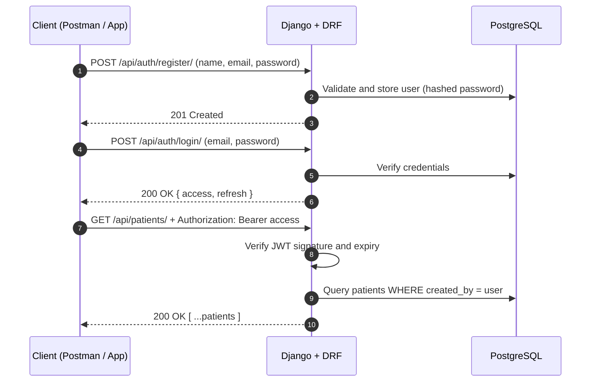

<div align="center">


### A production-style REST API for managing patients, doctors and their assignments

<p>
  
  
  
  
  
</p>

<p>
  
  
  
  
  
</p>

[Overview](#-overview) •
[Features](#-features) •
[Architecture](#-architecture) •
[Quick Start](#-quick-start) •
[API Reference](#-api-reference) •
[Testing](#-testing-the-api) •
[Author](#-author)

</div>

---

## 📖 Overview

This project is the backend of a healthcare application. It lets users **register**, **log in** with JWT authentication, and then **securely manage patient and doctor records** and **assign doctors to patients**.

It was built to demonstrate clean project structure, correct use of the Django ORM, proper authentication and authorization, input validation, and consistent error handling, all backed by **PostgreSQL**.

> **In one sentence:** a user signs up, logs in, adds their patients, browses the doctor directory, and links the right doctor to the right patient, and no one else can touch their patient data.

---

## ✨ Features

| | Feature | Details |
|---|---|---|
| 🔐 | **JWT authentication** | Register and log in, receive access and refresh tokens (`djangorestframework-simplejwt`) |
| 🧑‍🤝‍🧑 | **Patient management** | Full CRUD, scoped so each user only sees their own patients |
| 🩺 | **Doctor management** | Full CRUD, readable by all authenticated users, editable only by the creator |
| 🔗 | **Patient-doctor mapping** | Assign, list, filter by patient and remove, with duplicate prevention |
| 🛡️ | **Object-level security** | Other users' patients return `404`, other users' doctors return `403` on write |
| ✅ | **Validation** | Serializer-level rules, password strength checks, unique constraints |
| ⚠️ | **Consistent errors** | Predictable JSON error bodies with correct HTTP status codes |
| 🔑 | **Environment config** | Secrets and DB credentials live in `.env`, never in code |
| 🗄️ | **PostgreSQL + ORM** | Relational modelling with foreign keys and a composite unique constraint |

---

## 🧰 Tech Stack

<div align="center">

| Layer | Technology | Purpose |
|:---:|:---:|:---|
| **Language** |  | Core language |
| **Framework** |  | Web framework and ORM |
| **API** |  | Serializers, viewsets, permissions |
| **Auth** |  | Token-based authentication |
| **Database** |  | Persistent storage |
| **Config** |  | Environment variables |
| **Tools** |     | Development and testing |

</div>

---

## 🏗️ Architecture

### Project structure

```text
healthcare_backend/
├── config/                 # Project settings and root URL routing
│   ├── settings.py
│   └── urls.py
├── accounts/               # Registration and login (JWT)
│   ├── serializers.py
│   ├── views.py
│   └── urls.py
├── patients/               # Patient model, serializer, viewset
│   ├── models.py
│   ├── serializers.py
│   ├── views.py
│   └── urls.py
├── doctors/                # Doctor model, serializer, viewset, permission
│   ├── models.py
│   ├── serializers.py
│   ├── permissions.py
│   ├── views.py
│   └── urls.py
├── mappings/               # Patient-doctor assignments
│   ├── models.py
│   ├── serializers.py
│   ├── views.py
│   └── urls.py
├── .env.example            # Template for environment variables
├── .gitignore
├── manage.py
├── requirements.txt
└── README.md
```

Each domain lives in its **own Django app**, which keeps responsibilities separate and makes the code easy to extend and test.

### Database schema



> `MAPPING` has a **unique constraint on (patient, doctor)**, so the same doctor can never be assigned to the same patient twice.

### Authentication flow



---

## 🚀 Quick Start

### Prerequisites

| Tool | Version | Check with |
|---|---|---|
| Python | 3.10 or higher | `python --version` |
| PostgreSQL | 14 or higher | `psql --version` |
| Git | any recent | `git --version` |

### 1. Clone the repository

```bash
git clone https://github.com/Yash260302/Healthcare---DJANGO.git
cd Healthcare---DJANGO
```

### 2. Create and activate a virtual environment

<details open>
<summary><b>🪟 Windows (PowerShell)</b></summary>

```powershell
python -m venv venv
venv\Scripts\activate
```

If PowerShell blocks the script, run this once and try again:

```powershell
Set-ExecutionPolicy -Scope CurrentUser -ExecutionPolicy RemoteSigned
```

</details>

<details>
<summary><b>🍎 macOS / 🐧 Linux</b></summary>

```bash
python3 -m venv venv
source venv/bin/activate
```

</details>

### 3. Install dependencies

```bash
python -m pip install --upgrade pip
pip install -r requirements.txt
```

### 4. Create the PostgreSQL database

```bash
psql -U postgres -c "CREATE DATABASE healthcare_db;"
```

### 5. Configure environment variables

Copy the template and fill in your values:

```bash
# Windows
copy .env.example .env
# macOS / Linux
cp .env.example .env
```

| Variable | Description | Example |
|---|---|---|
| `SECRET_KEY` | Django secret key (keep private) | *generate below* |
| `DEBUG` | `True` for development, `False` in production | `True` |
| `ALLOWED_HOSTS` | Comma-separated hostnames, no spaces | `localhost,127.0.0.1` |
| `DB_NAME` | PostgreSQL database name | `healthcare_db` |
| `DB_USER` | PostgreSQL user | `postgres` |
| `DB_PASSWORD` | PostgreSQL password | `your_password` |
| `DB_HOST` | Database host | `localhost` |
| `DB_PORT` | Database port | `5432` |

Generate a secure `SECRET_KEY`:

```bash
python -c "from django.core.management.utils import get_random_secret_key; print(get_random_secret_key())"
```

### 6. Run migrations and start the server

```bash
python manage.py migrate
python manage.py runserver
```

The API is now live at **`http://127.0.0.1:8000/`** 🎉

---

## 📡 API Reference

**Base URL:** `http://127.0.0.1:8000/api`

All endpoints except **register** and **login** require this header:

```http
Authorization: Bearer <your_access_token>
Content-Type: application/json
```

### Endpoint summary

#### 🔐 Authentication

| Method | Endpoint | Auth | Description |
|:---:|---|:---:|---|
|  | `/auth/register/` | ❌ | Register a new user |
|  | `/auth/login/` | ❌ | Log in and receive JWT tokens |

#### 🧑‍🤝‍🧑 Patients

| Method | Endpoint | Auth | Description |
|:---:|---|:---:|---|
|  | `/patients/` | ✅ | Add a new patient |
|  | `/patients/` | ✅ | List patients created by you |
|  | `/patients/<id>/` | ✅ | Get one patient |
|  | `/patients/<id>/` | ✅ | Update a patient |
|  | `/patients/<id>/` | ✅ | Delete a patient |

#### 🩺 Doctors

| Method | Endpoint | Auth | Description |
|:---:|---|:---:|---|
|  | `/doctors/` | ✅ | Add a new doctor |
|  | `/doctors/` | ✅ | List all doctors |
|  | `/doctors/<id>/` | ✅ | Get one doctor |
|  | `/doctors/<id>/` | ✅ | Update a doctor (creator only) |
|  | `/doctors/<id>/` | ✅ | Delete a doctor (creator only) |

#### 🔗 Patient-Doctor Mappings

| Method | Endpoint | Auth | Description |
|:---:|---|:---:|---|
|  | `/mappings/` | ✅ | Assign a doctor to a patient |
|  | `/mappings/` | ✅ | List all your mappings |
|  | `/mappings/<patient_id>/` | ✅ | All doctors assigned to a patient |
|  | `/mappings/<id>/` | ✅ | Remove a mapping |

> ⚠️ **Note on `/mappings/<n>/`:** as defined in the assignment, the same URL shape is used for two purposes. With **GET**, `<n>` is a **patient id**. With **DELETE**, `<n>` is a **mapping id**.

---

### 🔐 Authentication examples

<details>
<summary><b>POST /api/auth/register/</b></summary>

**Request**

```json
{
  "name": "Asha",
  "email": "asha@test.com",
  "password": "StrongPass123"
}
```

**Response `201 Created`**

```json
{
  "message": "User registered successfully.",
  "id": 1,
  "name": "Asha",
  "email": "asha@test.com"
}
```

**Response `400 Bad Request`** (duplicate email)

```json
{
  "email": ["A user with this email already exists."]
}
```

**Response `400 Bad Request`** (weak password)

```json
{
  "password": [
    "Ensure this field has at least 8 characters."
  ]
}
```

**cURL**

```bash
curl -X POST http://127.0.0.1:8000/api/auth/register/ \
  -H "Content-Type: application/json" \
  -d '{"name":"Asha","email":"asha@test.com","password":"StrongPass123"}'
```

</details>

<details>
<summary><b>POST /api/auth/login/</b></summary>

**Request**

```json
{
  "email": "asha@test.com",
  "password": "StrongPass123"
}
```

**Response `200 OK`**

```json
{
  "access": "eyJhbGciOiJIUzI1NiIsInR5cCI6IkpXVCJ9...",
  "refresh": "eyJhbGciOiJIUzI1NiIsInR5cCI6IkpXVCJ9..."
}
```

**Response `401 Unauthorized`**

```json
{
  "detail": "Invalid email or password."
}
```

**cURL**

```bash
curl -X POST http://127.0.0.1:8000/api/auth/login/ \
  -H "Content-Type: application/json" \
  -d '{"email":"asha@test.com","password":"StrongPass123"}'
```

Token lifetimes: **access = 1 hour**, **refresh = 1 day**.

</details>

---

### 🧑‍🤝‍🧑 Patient examples

<details>
<summary><b>POST /api/patients/</b>: create a patient</summary>

**Request**

```json
{
  "name": "Ravi Kumar",
  "age": 45,
  "gender": "Male",
  "phone": "9876543210",
  "address": "Kanpur",
  "medical_history": "Diabetes"
}
```

**Response `201 Created`**

```json
{
  "id": 2,
  "name": "Ravi Kumar",
  "age": 45,
  "gender": "Male",
  "phone": "9876543210",
  "address": "Kanpur",
  "medical_history": "Diabetes",
  "created_at": "2026-10-08T19:41:28.765437Z",
  "updated_at": "2026-10-08T19:41:28.765444Z",
  "created_by": 1
}
```

**Response `400 Bad Request`** (invalid age)

```json
{
  "age": ["Enter a valid age."]
}
```

**cURL**

```bash
curl -X POST http://127.0.0.1:8000/api/patients/ \
  -H "Authorization: Bearer <access_token>" \
  -H "Content-Type: application/json" \
  -d '{"name":"Ravi Kumar","age":45,"gender":"Male","phone":"9876543210","address":"Kanpur","medical_history":"Diabetes"}'
```

</details>

<details>
<summary><b>GET /api/patients/</b>: list your patients</summary>

**Response `200 OK`**

```json
[
  {
    "id": 2,
    "name": "Ravi Kumar",
    "age": 45,
    "gender": "Male",
    "phone": "9876543210",
    "address": "Kanpur",
    "medical_history": "Diabetes",
    "created_at": "2026-10-08T19:41:28.765437Z",
    "updated_at": "2026-10-08T19:41:28.765444Z",
    "created_by": 1
  }
]
```

Only patients created by the authenticated user are returned.

</details>

<details>
<summary><b>GET / PUT / DELETE /api/patients/&lt;id&gt;/</b></summary>

| Method | Result |
|---|---|
| `GET` | `200` with the patient object |
| `PUT` | `200` with the updated object (send the full object) |
| `DELETE` | `204 No Content` |

**Response `404 Not Found`** (missing id, or a patient owned by someone else)

```json
{
  "detail": "No Patient matches the given query."
}
```

</details>

---

### 🩺 Doctor examples

<details>
<summary><b>POST /api/doctors/</b>: create a doctor</summary>

**Request**

```json
{
  "name": "Dr. Meera Sharma",
  "specialization": "Cardiologist",
  "email": "meera.sharma@hospital.com",
  "phone": "9123456780",
  "experience_years": 12
}
```

**Response `201 Created`**

```json
{
  "id": 1,
  "name": "Dr. Meera Sharma",
  "specialization": "Cardiologist",
  "email": "meera.sharma@hospital.com",
  "phone": "9123456780",
  "experience_years": 12,
  "created_at": "2026-10-08T19:55:10.120000Z",
  "updated_at": "2026-10-08T19:55:10.120000Z",
  "created_by": 1
}
```

**Response `400 Bad Request`** (duplicate email)

```json
{
  "email": ["doctor with this email already exists."]
}
```

**Response `403 Forbidden`** (editing or deleting a doctor another user created)

```json
{
  "detail": "You do not have permission to perform this action."
}
```

</details>

<details>
<summary><b>GET /api/doctors/ and GET /api/doctors/&lt;id&gt;/</b></summary>

Any authenticated user can list and view **all** doctors. Only the creator can `PUT` or `DELETE` a given doctor.

</details>

---

### 🔗 Mapping examples

<details>
<summary><b>POST /api/mappings/</b>: assign a doctor to a patient</summary>

**Request**

```json
{
  "patient": 2,
  "doctor": 1
}
```

**Response `201 Created`**

```json
{
  "id": 1,
  "patient": 2,
  "patient_name": "Ravi Kumar",
  "doctor": 1,
  "doctor_name": "Dr. Meera Sharma",
  "assigned_at": "2026-10-08T20:05:33.410000Z"
}
```

**Response `400 Bad Request`** (duplicate assignment)

```json
{
  "non_field_errors": [
    "The fields patient, doctor must make a unique set."
  ]
}
```

**Response `400 Bad Request`** (someone else's patient)

```json
{
  "patient": ["You can only assign doctors to your own patients."]
}
```

**Response `400 Bad Request`** (doctor or patient does not exist)

```json
{
  "doctor": ["Invalid pk \"999\" - object does not exist."]
}
```

</details>

<details>
<summary><b>GET /api/mappings/</b>: all your mappings</summary>

**Response `200 OK`**

```json
[
  {
    "id": 1,
    "patient": 2,
    "patient_name": "Ravi Kumar",
    "doctor": 1,
    "doctor_name": "Dr. Meera Sharma",
    "assigned_at": "2026-10-08T20:05:33.410000Z"
  }
]
```

</details>

<details>
<summary><b>GET /api/mappings/&lt;patient_id&gt;/</b>: doctors for one patient</summary>

Here `<patient_id>` is the **patient's id**. Returns every mapping for that patient, or `404` if the patient does not exist or belongs to another user.

</details>

<details>
<summary><b>DELETE /api/mappings/&lt;id&gt;/</b>: remove a doctor from a patient</summary>

Here `<id>` is the **mapping's id**. Returns `204 No Content` on success, or `404` if not found.

</details>

---

## 🛡️ Security and Design Decisions

| Concern | How it is handled |
|---|---|
| **Password storage** | Hashed by Django's `create_user` (PBKDF2 by default), never stored in plain text |
| **Password strength** | Django's built-in validators run during registration |
| **Authentication** | Stateless JWT via `djangorestframework-simplejwt` |
| **Default permission** | `IsAuthenticated` is set **globally**, so every new endpoint is protected unless explicitly opened |
| **Data isolation** | Patient and mapping querysets are filtered by the authenticated user |
| **Information leakage** | Another user's patient returns `404`, not `403`, so its existence is not revealed |
| **Doctor ownership** | Custom `IsCreatorOrReadOnly` permission: read for all, write for the creator |
| **Secrets** | `SECRET_KEY`, DB credentials and `DEBUG` come from environment variables |
| **Duplicate data** | DB-level `unique_together` on mappings and `unique` on doctor email |
| **Read-only fields** | `created_by`, `created_at`, `updated_at` cannot be set by the client |
| **Login errors** | Same message for wrong email or wrong password, so accounts cannot be enumerated |

### Why these choices?

- **`ModelViewSet` + router** for patients and doctors gives all five CRUD endpoints with very little code and consistent behaviour.
- **Email as username** keeps login simple while still using Django's built-in `User` model and password hashing.
- **Separate apps per domain** keeps the project modular and easy to navigate.
- **`select_related`** on mapping queries avoids N+1 database queries when patient and doctor names are included.

---

## 🧪 Testing the API

### Using Postman

1. `POST /api/auth/register/`, then `POST /api/auth/login/` and copy the `access` token.
2. In any other request, open **Authorization → Bearer Token** and paste the token.
3. Create a patient and two doctors.
4. Map them with `POST /api/mappings/`.
5. Run through the checklist below.

### ✅ Test checklist

| Scenario | Expected |
|---|:---:|
| Register with valid data | `201` |
| Register with an existing email | `400` |
| Register with a short or weak password | `400` |
| Login with correct credentials | `200` + tokens |
| Login with a wrong password | `401` |
| Access any protected endpoint without a token | `401` |
| Create a patient with `age: 200` | `400` |
| Create a patient without `name` | `400` |
| Read, update, delete your own patient | `200` / `200` / `204` |
| Access another user's patient | `404` |
| Create a doctor with a duplicate email | `400` |
| View a doctor created by another user | `200` |
| Edit or delete a doctor created by another user | `403` |
| Map the same patient and doctor twice | `400` |
| Map a non-existent doctor or patient | `400` |
| Map a doctor to another user's patient | `400` |
| `GET /api/mappings/<patient_id>/` for a valid patient | `200` |
| `DELETE /api/mappings/<id>/` for a valid mapping | `204` |
| `GET` or `DELETE` a non-existent mapping | `404` |

### Inspecting the database

Open **pgAdmin 4** and go to `healthcare_db → Schemas → public → Tables` to see `auth_user`, `patients_patient`, `doctors_doctor` and `mappings_patientdoctormapping`.

---

## 📮 Postman Collection

A ready-to-import Postman collection is included in the repository:

```text
postman/Healthcare_API.postman_collection.json
```

Import it via **Postman → Import**, then set the collection variable `token` to your access token.

---

## ⚠️ HTTP Status Codes Used

| Code | Meaning | Where |
|:---:|---|---|
| `200` | OK | Successful GET, PUT, login |
| `201` | Created | Register, create patient, doctor, mapping |
| `204` | No Content | Successful DELETE |
| `400` | Bad Request | Validation errors, duplicates |
| `401` | Unauthorized | Missing or invalid token, wrong credentials |
| `403` | Forbidden | Editing or deleting another user's doctor |
| `404` | Not Found | Missing or inaccessible resource |

---

## 🔭 Possible Future Improvements

- [ ] Token refresh endpoint (`/api/auth/token/refresh/`) and logout with token blacklisting
- [ ] Pagination, search and filtering on list endpoints
- [ ] Automated tests with `pytest-django` or DRF's `APITestCase`
- [ ] Swagger / OpenAPI docs via `drf-spectacular`
- [ ] Role-based access (admin, doctor, receptionist)
- [ ] Dockerfile and `docker-compose` for one-command setup
- [ ] CI pipeline with GitHub Actions
- [ ] Rate limiting on auth endpoints

---

## 👨‍💻 Author

<div align="center">

### Yashasvi Verma

*Python and Django developer who enjoys building clean, secure backends.*

<p>
  <a href="https://www.linkedin.com/in/yashasviverma02">
    
  </a>
  <a href="https://github.com/Yash260302">
    
  </a>
  <a href="https://portfolio-yash-rose.vercel.app">
    
  </a>
  <a href="mailto:vyash0978@gmail.com">
    
  </a>
</p>

📧 **vyash0978@gmail.com**

</div>

---

<div align="center">

If you found this project useful, consider giving it a ⭐


</div>
